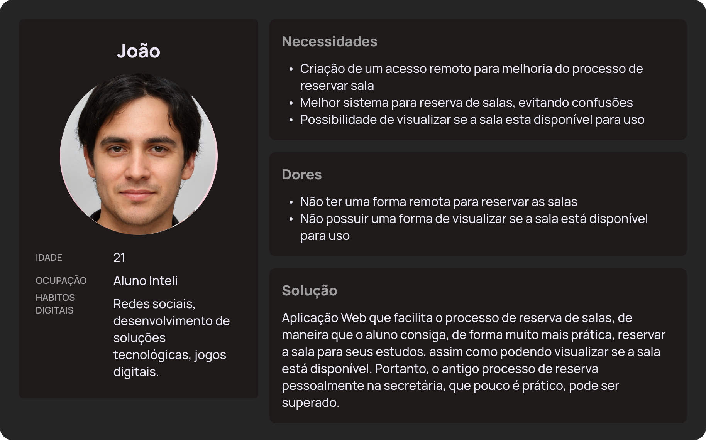
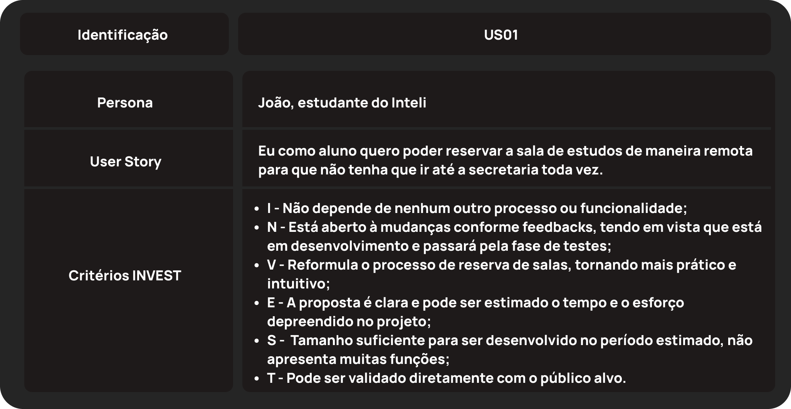
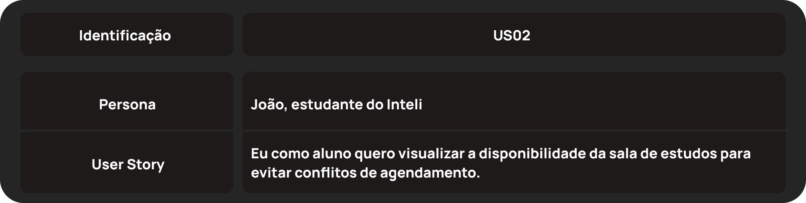
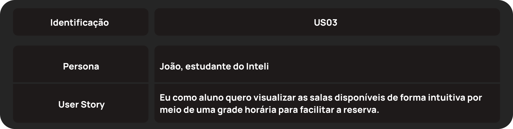
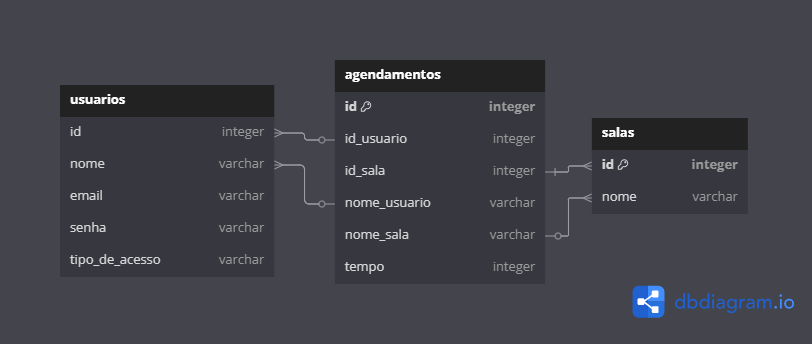
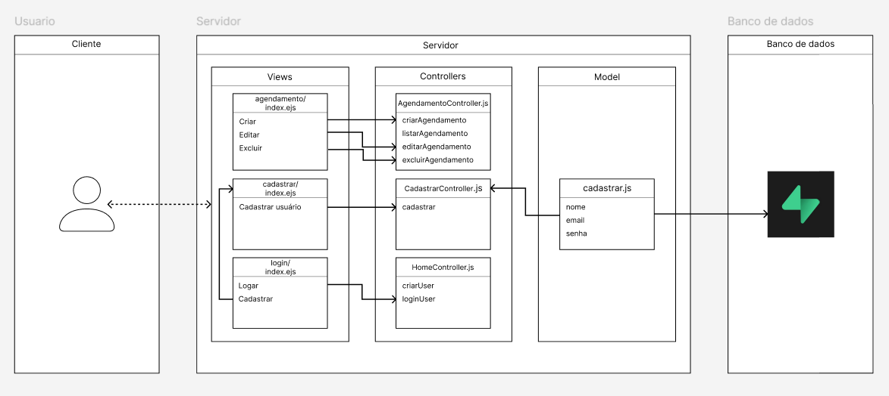
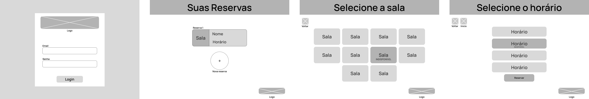

# Web Application Document - Projeto Individual - Módulo 2 - Inteli

## Reserva+

#### Rafael Gomes Ferreira

## Sumário

1. [Introdução](#c1)  
2. [Visão Geral da Aplicação Web](#c2)  
3. [Projeto Técnico da Aplicação Web](#c3)  
4. [Desenvolvimento da Aplicação Web](#c4)  
5. [Referências](#c5)  

<br>

## <a name="c1"></a>1. Introdução 

  Visando à uma maior autonomia dos alunos no processo de reserva de salas de estudos no Inteli, que muitas das vezes tem que ser realizado pessoalmente direto com a secretaria, que a Aplicação Web foi desenvolvida, levando em conta algumas limitações e funcionalidades: cada usuário têm a sua disposição diversas salas, em diversos horários, com prazo de duas horas cada, para alugar, podendo alugar apenas um horário por dia. Portanto, assim que reservado um horário, todos os outros ficarão indisponíveis para esse mesmo usuário. Caso um outro usuário queira conferir se aquela sala está disponível, ele poderá averiguar por meio do aplicativo.

---

## <a name="c2"></a>2. Visão Geral da Aplicação Web

### 2.1. Personas 

  Persona é uma representação fictícia, porém descrita como uma pessoa real, de um usuário do produto final. 
  A seguir é adicionado as personas do projeto, o primeiro deles sendo um aluno do Inteli que usará o sistema.

<div align="center">
<sub> Persona 1 - João </sub>
<br>
<br>

<br>
<sup>Fonte: Material produzido pelo autor (2025)</sup>
<br>
<br>
</div>

### 2.2. User Stories 

User Stories são funcionalidades de um produto do ponto de vista das personas/usuários do projeto.
A seguir é adicionada as User Stories referente as personas.

<div align="center">
<br>
<br>

<br>
<sup>Fonte: Material produzido pelo autor (2025)</sup>
<br>
<br>
</div>

<div align="center">
<br>
<br>

<br>
<sup>Fonte: Material produzido pelo autor (2025)</sup>
<br>
<br>
</div>

<div align="center">
<br>
<br>

<br>
<sup>Fonte: Material produzido pelo autor (2025)</sup>
<br>
<br>
</div>

---

## <a name="c3"></a>3. Projeto da Aplicação Web

### 3.1. Modelagem do banco de dados

Foi implementado um modelo inicial do banco de dados e suas relações. Inicialmente o banco foi modelado com a linguagem DBML no site "dbdiagram.io", como consta a imagem a seguir.

<div align="center">
<br>
<br>

<br>
<sup>Fonte: Material produzido pelo autor (2025)</sup>
<br>
<br>
</div>

Posteriormente, para facilitar que no futuro a tabela seja de fato criada a partir da linguagem SQL, a sua modelagem já foi passada para a linguagem correta:

```SQL
CREATE TABLE usuarios (
  id SERIAL PRIMARY KEY,
  nome VARCHAR(255),
  email VARCHAR(255),
  senha VARCHAR(255),
  tipo_de_acesso VARCHAR(50)
);

CREATE TABLE salas (
  id SERIAL PRIMARY KEY,
  nome VARCHAR(100)
);

CREATE TABLE agendamentos (
  id SERIAL PRIMARY KEY,
  id_usuario INTEGER,
  id_sala INTEGER,
  tempo INTEGER,

  FOREIGN KEY (id_usuario) REFERENCES usuarios(id),
  FOREIGN KEY (id_sala) REFERENCES salas(id)
);
```
Anteriormente, em DBML:

``` SQL
Table usuarios {
  id integer 
  nome varchar
  email varchar
  senha varchar
  tipo_de_acesso varchar
}

Table agendamentos {
  id integer [primary key]
  id_usuario integer
  id_sala integer
  nome_usuario varchar
  nome_sala varchar
  tempo integer
}

Table salas {
  id integer [primary key]
  nome varchar
}

Ref: usuarios.id > agendamentos.id_usuario
Ref: usuarios.nome > agendamentos.nome_usuario
Ref: salas.id > agendamentos.id_sala
Ref: salas.nome > agendamentos.nome_sala
```

### 3.1.1 BD e Models 
O model é responsável por conectar diretamente com o banco de dados e mandar suas requisições por meio de comandos. O sistema web apresenta apenas um Model pois todos outros comandos SQL já estão embutidos diretamente dentro de seus respectivos Controllers. O Model "models/cadastrar.js" tem como funcionalidade adicionar dentro do banco de dados, por meio do comando "INSERT INTO usuarios (nome, email, senha) VALUES ($1, $2, $3)", as informações inseridas pelo usuário.

### 3.2. Arquitetura

Um diagrama de arquitetura é uma representação visual do funcionamento de um sistema, este que demonstra através de setas como as partes que o formam se comunicam e se relacionam.

<div align="center">
<br>
<br>

<br>
<sup>Fonte: Material produzido pelo autor (2025)</sup>
<br>
<br>
</div>

Acesse o [Link do Figma](https://www.figma.com/design/CLjntr6GCi2InjVNrOtnLw/Untitled?node-id=3-81&t=mjS7u7leH8oHZSMa-1)

### 3.3. Wireframes 

A seguir, apresenta-se os Wireframes que representam a ideia inicial do design do projeto.
<div align="center">
<br>
<br>

<br>
<sup>Fonte: Material produzido pelo autor (2025)</sup>
<br>
<br>
</div>

Acesse o [Link do Figma](https://www.figma.com/design/yznNLG2MMrru9Ev7E5U7Zc/Logo-prot%C3%B3tipo?node-id=0-1&t=28IgerpBbBKAKjTu-1)


A primeira tela é a de login, a qual direciona para a segunda tela "suas reservas", que mostra as reservas atuais do usuário e disponibiliza um botão para ele criar novas reservas caso assim queira. Clicando em "nova reserva", o usuário é direcionado para a página de seleção de salas, na qual consta todas as salas a serem reservadas, aquelas sem horários disponíveis são mostradas como indisponíveis, se relacionando com a User Storie 2. Clicando na sala desejada, o usuário é destinado para a tela de seleção de horários, esta que também consta os horários disponíveis e indisponíveis, se relacionando com a User Storie 3. Por fim, todo esse processo se relaciona diretamente com a User Storie 1 por permitir que o usuário faça a reserva remotamente.

### 3.4. Guia de estilos (Semana 05)

*Descreva aqui orientações gerais para o leitor sobre como utilizar os componentes do guia de estilos de sua solução.*


### 3.5. Protótipo de alta fidelidade (Semana 05)

*Posicione aqui algumas imagens demonstrativas de seu protótipo de alta fidelidade e o link para acesso ao protótipo completo (mantenha o link sempre público para visualização).*

### 3.6. WebAPI e endpoints 

Endpoints são os caminhos finais que permitem a confecção do CRUD (Create, Read, Update e Delete) das funcionalidade dos projeto.
O projeto apresenta os seguinte Endpoints:
- **GET /agendamentos:** lista os agendamentos do usuário;
- **GET /cadastrar:** leva o usuário até a página de cadastro;
- **POST /agendamentos:** cria um novo agendamento;
- **POST /agendamentos:id?_method=PUT:** edita um agendamento;
- **POST /agendamentos:id?_method=DELETE:** deleta um agendamento;
- **POST /cadastrar:** cria um novo cadastro;
- **POST /login:** efetua o login do usuario cadastrado.

### 3.7 Interface e Navegação (Semana 07)

*Descreva e ilustre aqui o desenvolvimento do frontend do sistema web, explicando brevemente o que foi entregue em termos de código e sistema. Utilize prints de tela para ilustrar.*

---

## <a name="c4"></a>4. Desenvolvimento da Aplicação Web (Semana 8)

### 4.1 Demonstração do Sistema Web (Semana 8)

*VIDEO: Insira o link do vídeo demonstrativo nesta seção*
*Descreva e ilustre aqui o desenvolvimento do sistema web completo, explicando brevemente o que foi entregue em termos de código e sistema. Utilize prints de tela para ilustrar.*

### 4.2 Conclusões e Trabalhos Futuros (Semana 8)

*Indique pontos fortes e pontos a melhorar de maneira geral.*
*Relacione também quaisquer outras ideias que você tenha para melhorias futuras.*


## <a name="c5"></a>5. Referências

_Incluir as principais referências de seu projeto, para que seu parceiro possa consultar caso ele se interessar em aprofundar. Um exemplo de referência de livro e de site:_<br>

---
---
